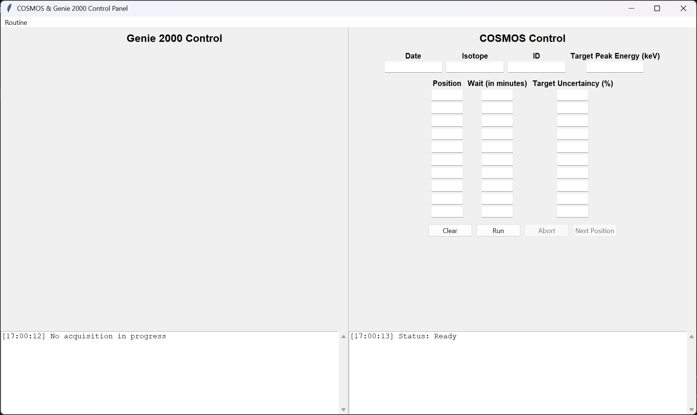

# Gamma Spectrometry Automation Program
This project automates the measurement process of a gamma spectrometer by integrating Velmex COSMOS software (for source positioning) and Genie 2000 (for data acquisition). It provides a graphical interface for users to define measurement parameters, execute a sequence of acquisitions, and save results automatically. The program supports flexible configuration, including uncertainty-based or time-based acquisition, and includes logging for both systems.



## Features

- User-friendly GUI built with Tkinter
- Automated movement control via Velmex COSMOS using the `serial` library
- Automated GUI interactions with Genie 2000 using `PyAutoGUI`
- Multi-threaded architecture to keep the interface responsive
- Screenshot logging at each stage for traceability
- Intelligent file naming to prevent overwriting
- Support for both time-based and uncertainty-based acquisitions
- Abort and skip handling with intermediate data saving

## Configuration

Before running the program, you need to adjust several default parameters in the code to match your setup:

- **Directory paths**: Update any paths (e.g., save directories, log folders) with your own file locations. Look for comments like `put/your/own/path/here`.
- **Serial port settings**: In `cosmos.py`, set the correct **COM port**, **baud rate**, and **speed** for your Velmex COSMOS system. Use the placeholders in the code (`put/your/port`, `put/your/baud`, `put/your/speed`) as guidance.
- **Energy-to-channel conversion**: If you’re using a different detector or calibration, ensure the energy-to-channel formula is updated accordingly.
- **Genie 2000 behavior**: Some interactions (e.g., window titles, warnings) may differ between systems. You may need to tweak PyAutoGUI interactions based on your Genie 2000 installation.

Make sure to review the code and replace placeholders with values suitable for your environment before running the program.
**Note:** This program uses PyAutoGUI to automate interactions with Genie 2000. Since PyAutoGUI relies on pixel-based screen coordinates, you must run Genie 2000 in a maximized window and capture the exact screen coordinates of its buttons on your own system. Update these coordinates in the code accordingly to ensure correct operation. Coordinate values may vary depending on screen resolution, scaling settings, and window layout.

## File Structure

- `gui.py`: Contains the main application interface and automation sequence logic
- `cosmos.py`: Handles serial communication with the Velmex COSMOS system
- `icon.ico`: Custom icon for the GUI application

## Installation

1. Make sure you have Python 3 installed
2. Install required libraries:

   ```bash
   pip install pyserial pyautogui

## Creating an Executable

1. Install PyInstaller:
   ```bash
   pip install pyinstaller

2. Create the executable:
   ```bash
   pyinstaller --onefile --windowed --icon=icon.ico gui.py

- This will generate the executable in the dist/ directory.

## How to Use

1. Launch the program
2. Enter the date, isotope, ID, and target energy
3. Fill in positions and either wait time or uncertainty (not both)
4. Click Run to begin automated acquisition
5. Use Skip to move to the next position or Abort to stop the run
6. Screenshots and saved files will be automatically handled

## License

This project is licensed under the GNU General Public License v3.0. See the [LICENSE](LICENSE) file for details.
